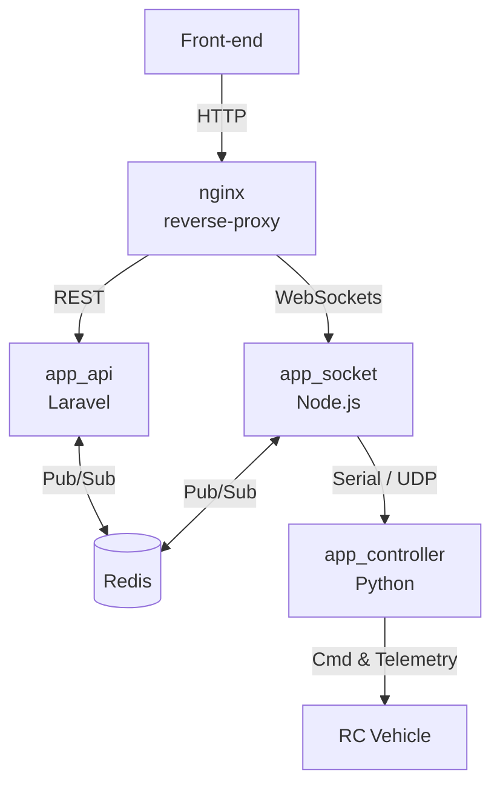

# RCNet – Containerised RC Vehicle Control System

> **Docker‑first, Raspberry Pi‑friendly framework for remotely controlling and monitoring *any* radio‑controlled vehicle – cars, boats, planes, multirotors or rovers.**

---

## Table of Contents

1. [About the Project](#about-the-project)
2. [Features](#features)
3. [Architecture](#architecture)
4. [Getting Started](#getting-started)

   1. [Prerequisites](#prerequisites)
   2. [Local Development](#local-development)
   3. [Running on Raspberry Pi](#running-on-raspberry-pi)
   4. [Over‑the‑Air Updates](#over-the-air-updates)
5. [Environment Variables](#environment-variables)
6. [Directory Structure](#directory-structure)
7. [Roadmap](#roadmap)
8. [Contributing](#contributing)
9. [License](#license)

---

## About the Project

**RCNet** is an open‑source, micro‑service control stack that separates low‑level vehicle I/O (servos, ESCs, sensors) from high‑level logic (APIs, UIs, autonomy).
A lightweight Python bridge runs on a Raspberry Pi (or your laptop) and talks to an Arduino/flight‑controller over serial, while Laravel & Node.js services expose REST and WebSocket endpoints for dashboards, mobile apps or AI agents.
Swap the firmware to support electric, nitro or gas power‑trains—the rest of the stack remains unchanged.

---

## Features

* **Service‑per‑container** architecture (Laravel, Node.js, Python, Redis, nginx).
* **Vehicle‑agnostic hardware layer** – only the Python module knows about UART, I²C, CAN or MAVLink.
* **Develop anywhere** – set `CONTROLLER_MOCK_SERIAL=1` to generate synthetic telemetry with *no hardware attached*.
* **Hot‑reload inside Docker** – Xdebug (PHP), Nodemon (Node.js) and Watchdog (Python) give instant feedback.
* **One‑liner bootstrap** – `docker compose up -d --build` spins up the entire stack.
* **Dual API surface** – REST for CRUD, WebSockets for sub‑50 ms command latency.
* **Secure OTA updates** – trigger `git pull && docker compose up` via an admin endpoint or a GPIO button.

---

## Architecture



| Container           | Technology           | Purpose                                      |
| ------------------- | -------------------- | -------------------------------------------- |
| **nginx**           | `nginx:alpine`       | Reverse proxy & TLS termination              |
| **app\_api**        | Laravel 12 · PHP 8.3 | REST endpoints, auth, business logic         |
| **app\_socket**     | Node.js 20           | Low‑latency WebSocket gateway                |
| **app\_controller** | Python 3.12          | Bridges Pi ↔ Arduino/FC, publishes telemetry |
| **redis**           | Redis 7              | High‑speed Pub/Sub bus                       |

---

## Getting Started

### Prerequisites

* Docker 24+ & Docker Compose v2
* Git
* (Optional) Raspberry Pi 3B/4/5 running 64‑bit Pi OS Lite

### Local Development

```bash
# Clone & boot the stack
git clone https://github.com/your‑org/rcnet.git
cd rcnet
cp .env.example .env   # customise ports or paths

docker compose up -d --build
```

The API is now available at **[http://localhost](http://localhost)** (or the port you set in `NGINX_PORT`).

> **Tip:** If no hardware is connected, enable the software simulator:
>
> ```dotenv
> CONTROLLER_MOCK_SERIAL=1
> ```
>
> The controller will emit fake battery voltage, speed and GPS so you can build the UI first.

### Running on Raspberry Pi

1. Flash Pi OS Lite, enable SSH and boot.
2. Install Docker & Compose (see `scripts/setup-docker.sh`). (TODO!)
3. Clone this repo onto the Pi:

   ```bash
   git clone https://github.com/pihedy/rcnet.git
   cd rcnet
   ```
4. Edit `.env` and set the serial device path, e.g. `/dev/ttyUSB0`.
5. Build & launch the stack:

   ```bash
   docker compose up -d --build
   ```
6. (Optional) Move the containers to an external SSD once reliability tests pass.

### Over‑the‑Air Updates

Trigger a full update remotely (or via a GPIO button):

```bash
curl -X POST http://<pi‑ip>/api/v1/admin/update
```

The endpoint performs `git pull && docker compose up -d --build` and streams logs to Redis.

---

## Environment Variables

| Variable              | Default   | Description                                       |
| --------------------- | --------- | ------------------------------------------------- |
| `APP_DEBUG`           | `true`    | Verbose logging & Xdebug (port 9293)              |
| `NGINX_PORT`          | `80`      | Host port exposing HTTP                           |
| `REDIS_PORT`          | `6379`    | Host port mapping for Redis                       |
| `CONTROLLER_USB_PATH` | *(empty)* | Serial device path on the Pi                      |
| `MOCK_SERIAL`         | `1`       | Emit dummy telemetry when no vehicle is connected |

All variables from `.env` are injected into every container via `env_file:` in **docker-compose.yml**.

---

## Directory Structure

```text
.
├── api/          # Laravel application
├── socket/       # Node.js WebSocket server
├── controller/   # Python hardware bridge
├── docker/       # nginx & PHP config templates
├── scripts/      # helper & install scripts (TODO!)
├── .env.example
└── docker-compose.yml
```

---

## Roadmap

* Pluggable driver modules: PWM, DShot, CAN, MAVLink
* Lidar / camera fusion for obstacle avoidance
* Autonomous navigation experiments with ROS 2
* Next.js telemetry dashboard & mission planner
* Scheduled OTA with automatic rollback

---

## Contributing

Issues and PRs are welcome! Please make sure tests and linters pass before submitting:

```bash
composer test
npm run lint
```

---

## License

Released under the **MIT License** – see [`LICENSE`](LICENSE) for details.
